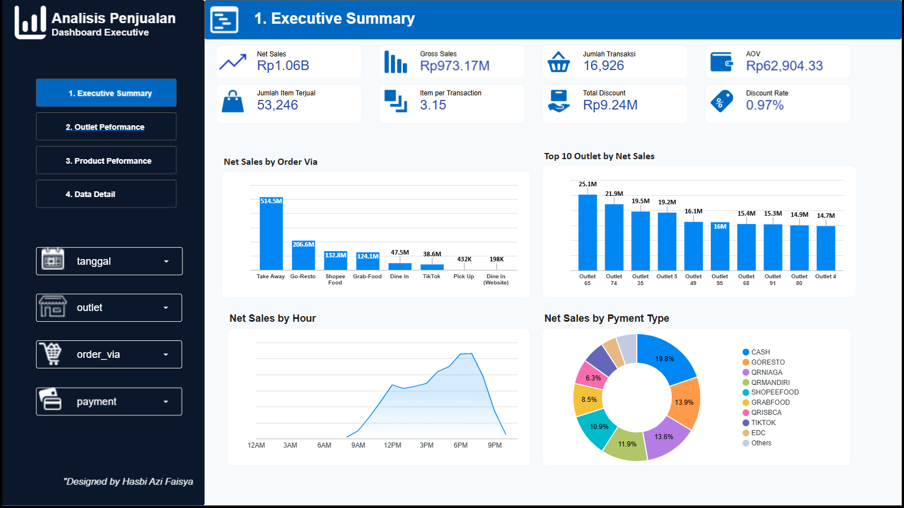
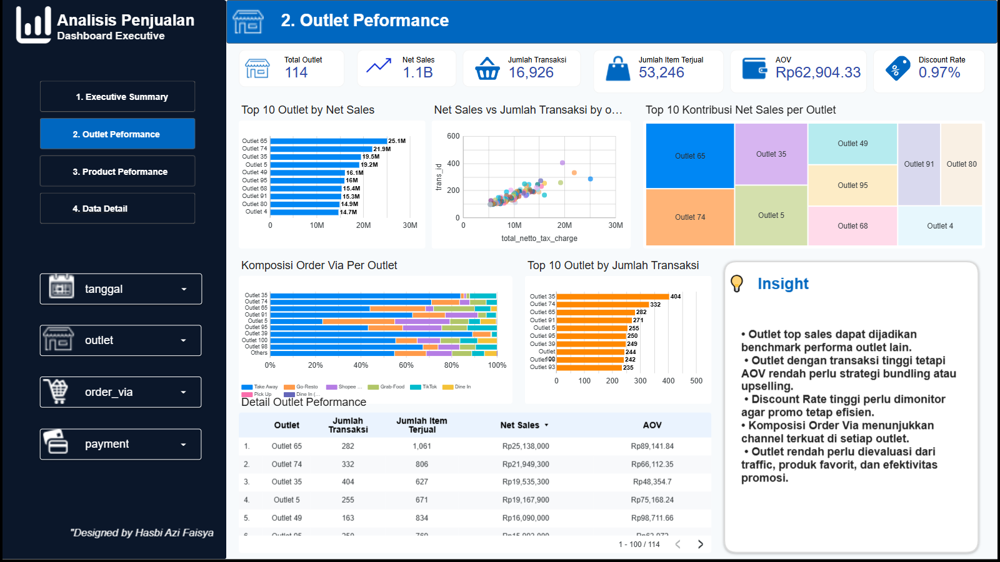
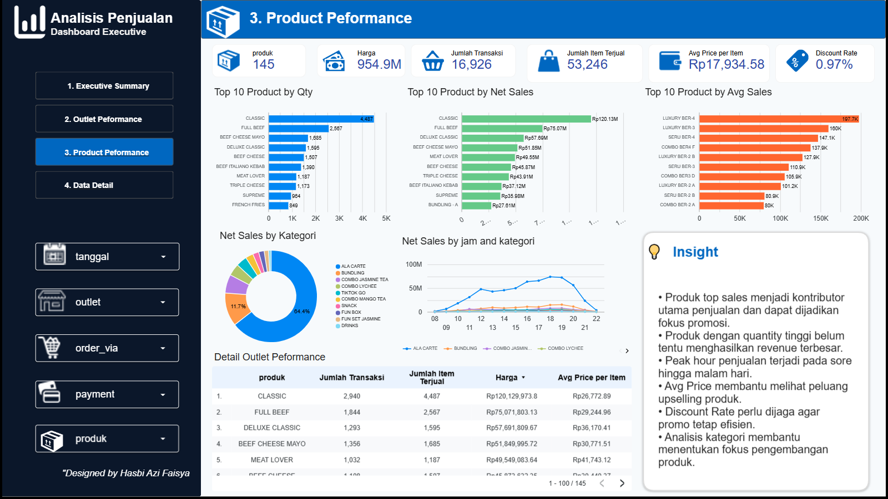

# F&B Sales Analytics Dashboard

## Project Overview

This project is a sales analytics dashboard built using Google Looker Studio. The dashboard analyzes sales performance from an F&B business dataset, focusing on sales trends, outlet performance, product performance, order channels, payment methods, and discount effectiveness.

The goal of this project is to transform raw transactional data into actionable business insights that can support decision-making in sales strategy, outlet evaluation, product optimization, and promotional planning.

## Tools Used

- Google Looker Studio
- Google Sheets
- Microsoft Excel
- Data Visualization
- Business Intelligence
- Exploratory Data Analysis

## Dataset

The dataset consists of two main tables:

1. **Sales per Invoice Outlet**
   - Transaction ID
   - Invoice
   - Date
   - Time
   - Outlet
   - Order via
   - Payment type
   - Gross sales
   - Discount
   - Net sales

2. **Sales SKU**
   - Transaction ID
   - Product
   - Category
   - Variant
   - Quantity
   - Discount
   - Net sales
   - Outlet
   - Order via
   - Time

## Dashboard Pages

### 1. Executive Summary

This page provides a high-level overview of overall sales performance.

Key metrics:
- Net Sales
- Gross Sales
- Total Transactions
- Total Quantity Sold
- Average Order Value
- Item per Transaction
- Total Discount
- Discount Rate

Main visuals:
- Net Sales by Order Via
- Top 10 Outlet by Net Sales
- Net Sales by Hour
- Sales by Payment Type

### 2. Outlet Performance

This page analyzes the performance of each outlet based on sales, transactions, AOV, order channel, and discount rate.

Main visuals:
- Top 10 Outlet by Net Sales
- Sales vs Transaction
- Outlet Contribution
- Order Via Composition by Outlet
- Outlet by Discount Rate
- Detail Outlet Performance Table

### 3. Product Performance

This page focuses on product and category performance.

Main visuals:
- Top 10 Product by Net Sales
- Top 10 Product by Quantity Sold
- Net Sales by Category
- Net Sales by Category and Hour
- Product Discount Rate
- Detail Product Performance Table

## Key Insights

- Take Away is the strongest sales channel and contributes significantly to total revenue.
- Several online food delivery channels also contribute meaningfully to sales performance.
- ALA CARTE is the dominant product category in terms of revenue contribution.
- Sales tend to increase during afternoon to evening peak hours.
- Some products with high quantity sold do not always generate the highest revenue.
- Discount rate needs to be monitored to ensure promotional efficiency.
- Outlet performance varies across sales, transaction volume, AOV, and order channel composition.

## Business Recommendations

- Maintain and promote best-selling products as the main revenue drivers.
- Optimize bundling strategies to increase Average Order Value.
- Focus stock and staffing preparation during peak sales hours.
- Monitor outlets with high discount rates to prevent margin pressure.
- Compare high-performing outlets with low-performing outlets to identify improvement opportunities.
- Strengthen online delivery channels while maintaining Take Away performance.

## Dashboard Preview

### Executive Summary

### Outlet Performance

### Product Performance

## Looker Studio Dashboard

Dashboard link:

[View Dashboard Here](https://datastudio.google.com/reporting/260821e1-4025-4181-978d-ebc4d38e06a3)

## Author

Created by Hasbi Azi Faisya

- GitHub: [hasbiazif](https://github.com/hasbiazif)
- Portfolio Project: F&B Sales Analytics Dashboard
